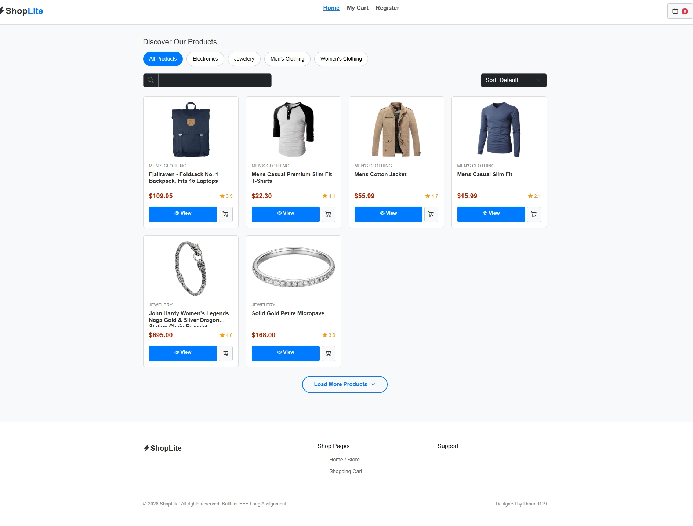
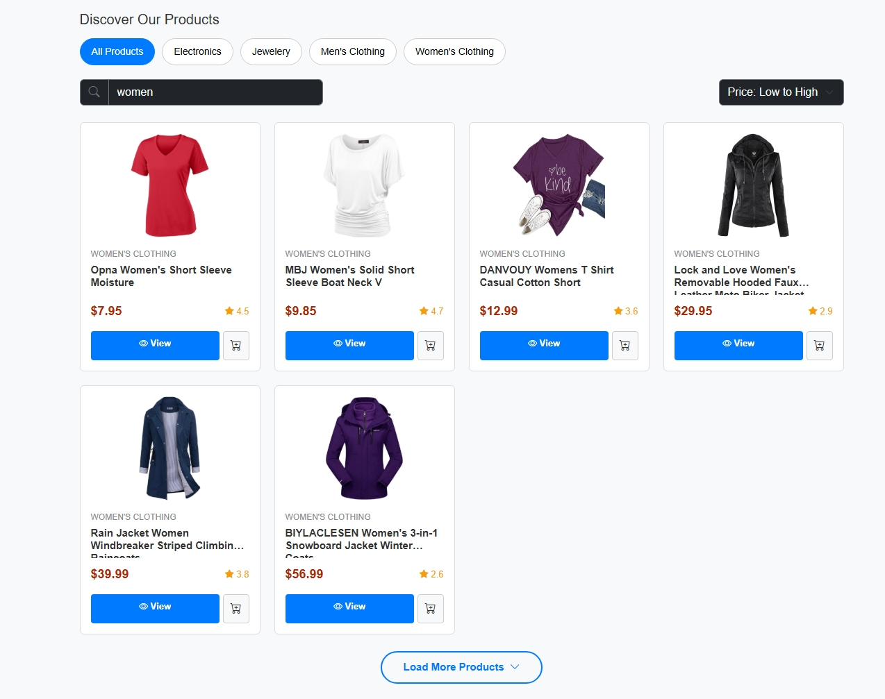
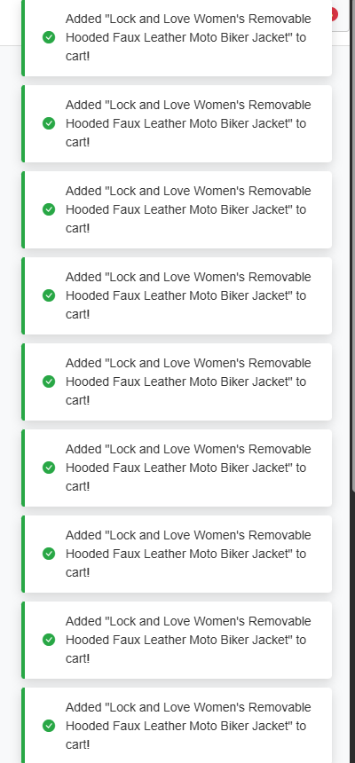
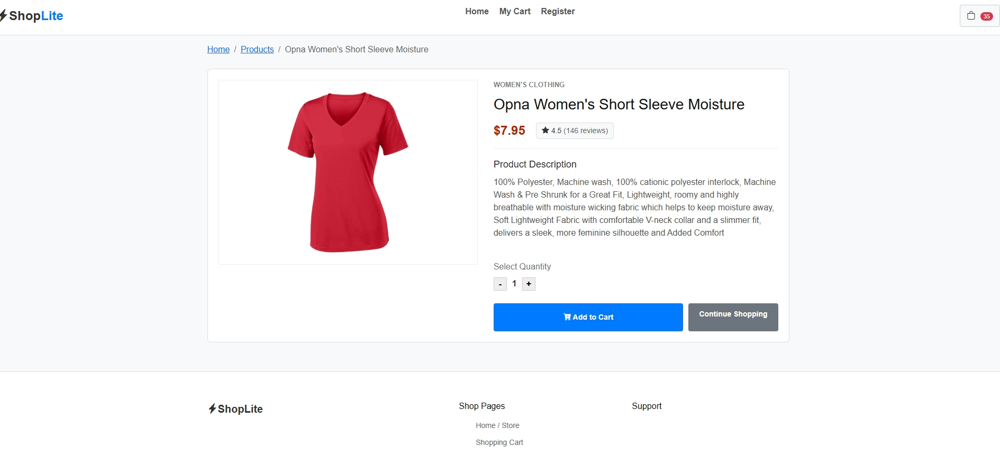
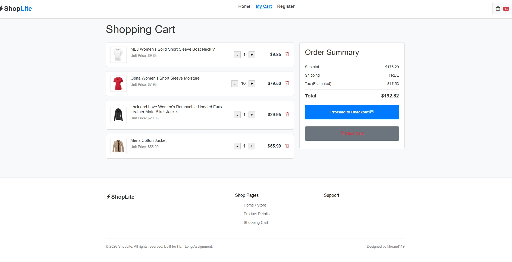
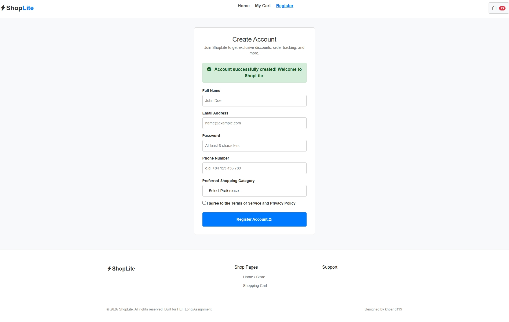

# ShopLite - Mini E-Commerce Client Website

> **Live Demo:** <https://meocute5104.github.io/fef-shoplite-khoand119/>

Welcome to **ShopLite** — a lightweight, client-side, multi-page shopping platform. This application interacts with the public **Fake Store API** to dynamically display collections, item specifications, and manage shopping carts directly on the browser.

Designed as part of the **FEF (Front-End Foundation) Long Assignment**.

---

## 1. Description

ShopLite is a fast, responsive, and clean client-side multi-page application built using semantic HTML5, CSS3, Bootstrap 5, and vanilla JavaScript. It fetches live data from the Fake Store API and manages a shopping cart locally using `localStorage`.

### Key Features:

- **Catalog Management:** Fetching products dynamically, filtering by categories, sorting by title and price.
- **Client-side Pagination:** "Load More" functionality showing 6 items per page.
- **Cart Operations:** Persisted cart in LocalStorage, count badge sync, quantity modifiers, and subtotal/tax/total computations.
- **Account Registration:** Real-time form validations with descriptive error states.
- **Enhanced UX:** Search debouncing (300ms) and beautiful custom Toast notifications replacing browser alerts.

---

## 2. Design & Layout Philosophy

- **Extreme Simplicity (Beginner-Friendly):** The website's interface is kept clean, elementary, and minimalist. There are no heavy animations, complex gradients, or glowing shadows.
- **Light Theme:** Features a pure light-mode color theme (`white` and `#f8f9fa` backgrounds) with dark grey text (`#333333`) and standard borders (`1px solid #ccc`).
- **Standard Typography:** Arial / Helvetica / sans-serif (basic system fonts).
- **Responsive Layout:** Pure, hand-written CSS layout rules utilizing CSS Grid and Flexbox to adjust configurations for mobile viewports cleanly.

---

## 3. Screenshots (Placeholder)

*Hãy thay thế các đường dẫn hình ảnh dưới đây bằng ảnh chụp màn hình thực tế của bạn:*

### A. Trang chủ (Homepage) & Danh sách sản phẩm

- Hiển thị danh mục sản phẩm, bộ lọc, ô tìm kiếm và sắp xếp.
  

### B. Tìm kiếm, Lọc, Sắp xếp & Phân trang Load More

- Kết quả tìm kiếm kết hợp bộ lọc danh mục, sắp xếp giá và phân trang "Load More" hoạt động đồng thời.
  

### C. Thông báo Toast tùy chỉnh (Custom Toast Notifications)

- Hiển thị thông báo khi tương tác thêm sản phẩm thành công mà không dùng hộp thoại alert.
  

### D. Trang chi tiết sản phẩm (Product Details)

- Thông tin đầy đủ của sản phẩm dựa trên ID truyền vào URL.
  

### E. Giỏ hàng (Shopping Cart Page)

- Danh sách giỏ hàng, cập nhật số lượng, tổng tiền chi tiết (bao gồm thuế 10%).
  

### F. Trang đăng ký tài khoản (Register Page)

- Giao diện đăng ký thành công khi toàn bộ các trường nhập liệu hợp lệ.
  

---

## 4. Completed Feature Checklists

### Tier 1: Pass Tier

- [x] **All 4 Pages Integrated** : Clean navbar routing linking index page, detail pages, shopping cart, and registrations.
- [x] **Semantic HTML** : Constructed with `header`, `nav`, `main`, `section`, and `footer` elements.
- [x] **Dynamic Catalog Load** : Home page fetches the array list from Fake Store API and appends cards via JavaScript DOM nodes.
- [x] **Detail Viewer** : Product details page pulls the parameters ID from `window.location.search`, loads product details from the API, and renders them.
- [x] **Register Form Validator** : Custom client-side validation logic that validates formats (email formats, name length, phone numbers, selects) and blocks invalid forms.
- [x] **Standard Responsiveness** : Breakpoints styled to prevent container overflow.

### Tier 2: Good Tier

- [x] **Full Shopping Cart** : LocalStorage-backed cart updates quantities, updates subtotals/totals, deletes items, and preserves items between pages.
- [x] **Search or Filter by Category** : Displays product categories dynamically, allowing search and single-click categories filtering, updating the grid immediately.
- [x] **Spinner & Error Indicators** : Standard animations for loading states and warning banners/error states for network failures.
- [x] **Clean Layout Rules** : Pure CSS with standard, hand-written media queries and smooth responsiveness across all three breakpoints.

### Tier 3: Excellent Tier

- [x] **Event Delegation** : Click handlers bound to parent grid nodes (`productsGrid` and `cartItemsList`) to manage events efficiently.
- [x] **Combined Search + Filter + Sort** : Evaluates active search key, category tabs, and sort selections (price high-low/low-high, alphabetical names) simultaneously.
- [x] **Cart Count Badge** : Header icons display dynamic item count counts synced across all pages on load.
- [x] **Pagination / "Load More"** : Shows 6 items per page initially and appends 6 more on clicking the "Load More" button under the catalog grid.
- [x] **Good Experience (Toast & Debounce)** : Includes custom, elegant CSS/JS toast notifications replacing browser alert dialogs, and a 300ms debounce on the catalog search box input.
- [x] **High-quality Source Code** : Extracted reusable modules/functions inside `js/api.js`, standard naming conventions, and custom CSS files split logically per page.

**Total Project Score: 10.0 / 10.0 Points**

---

## 5. Directory Structures

```
fef-shoplite-khoand119/
├── index.html              # Home page store template
├── product.html            # Individual product detail template
├── cart.html               # Cart manager list template
├── register.html           # Account creator form template
├── README.md               # User guide (This file)
├── .gitignore              # Dependency ignores
├── assets/                 # Screenshot assets
│   ├── Cart.jpeg
│   ├── CreateAccountSuccess.jpeg
│   ├── CustomToast.png
│   ├── HomePage_ListProduct.jpeg
│   ├── ProductDetail.jpeg
│   └── Search_and_Filter_Sort_Pagination_Loadmore.jpeg
├── css/
│   ├── share_style.css     # Shared parameters, header/navbar, footer, loaders, buttons
│   ├── index_style.css     # Index page catalog components
│   ├── product_style.css   # Product details specifications
│   ├── cart_style.css      # Shopping cart rows lists and totals
│   ├── register_style.css  # Register form controls and validations
│   └── style.css           # Deprecated / legacy core style entry
└── js/
    ├── api.js              # Fake Store API request client
    ├── cart.js             # Cart storage operations and rendering logic
    ├── home.js             # Store catalog filtering and sorting logic
    ├── product.js          # Detail page data binders
    └── register.js         # Input validations checking scripts
```

---

## 6. How to Run Locally

Since the application runs entirely in the client-side browser, you do not need active compilers or complex servers:

1. Clone or download the repository folder: `fef-shoplite-khoand119/`.
2. Locate the main file: `index.html`.
3. Open `index.html` using any modern browser (Chrome, Firefox, Safari, Edge) by double-clicking it.
4. (Optional) Run a simple local server to avoid browser localStorage/CORS checks in older setups:
   - Python 3: Run `python -m http.server 8000` inside the folder and visit `http://localhost:8000`.
   - VS Code extension: Install **Live Server**, right-click `index.html` and click **Open with Live Server**.
